## A mobile app for reminding about an new tv shows episodes (in progress...)
### Powered by:

-  [Ionic](https://ionicframework.com/)

-  [Angular](https://angular.io/)

-  [Cordova](https://cordova.apache.org/)

-  [NodeJS](https://nodejs.org/)

-  [TypeScript](https://www.typescriptlang.org/)

- [Anilist API](http://anilist-api.readthedocs.io/en/latest/)

The app allows to browse through currently airing animes (using online rest api) and create an custom list of titles of user's choice. Based on that, the app user will receive an mobile notification each time when an new episode will be aired. The notification time preferences can be changed (it can appear on real airing date and time or custom hour after premiere). The app provides an various search options as well. 

I'm considering linking the app with the firebase database. It would provide a personal account held online and login system. I would implement the friends system, where You could follow the others's lists and get recomendations based on their activity.

More info alongside with screenshots below.

#

The main screen, which is 'Watching' tab, allows to navigate through animes added to watching list. It's always sorted by the fastest next episode airing date of each title. It features  cover, title and time left to next episode of the very first anime's new episode which will be available to seen.  
After the premiere of the new episode, the list's position will be flaged with the number of episodes which the user haven't seen, unless it will be marked as watched*.  
After an title of choice selection, the full title, the next episode date and the episodes status will be shown.

*The following feature is currently in development. On the screen You see the next numer of the episode, which will be aired, as the demonstration of GUI.

|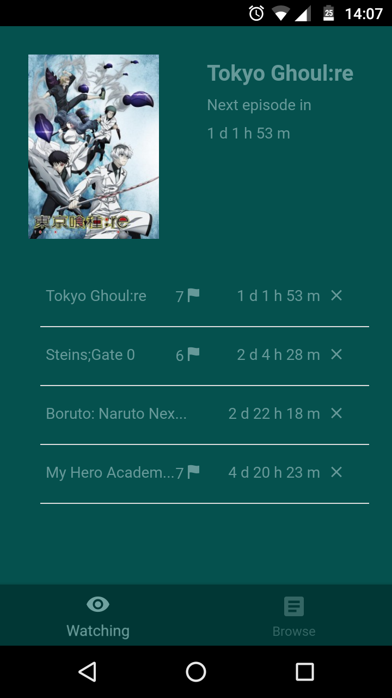|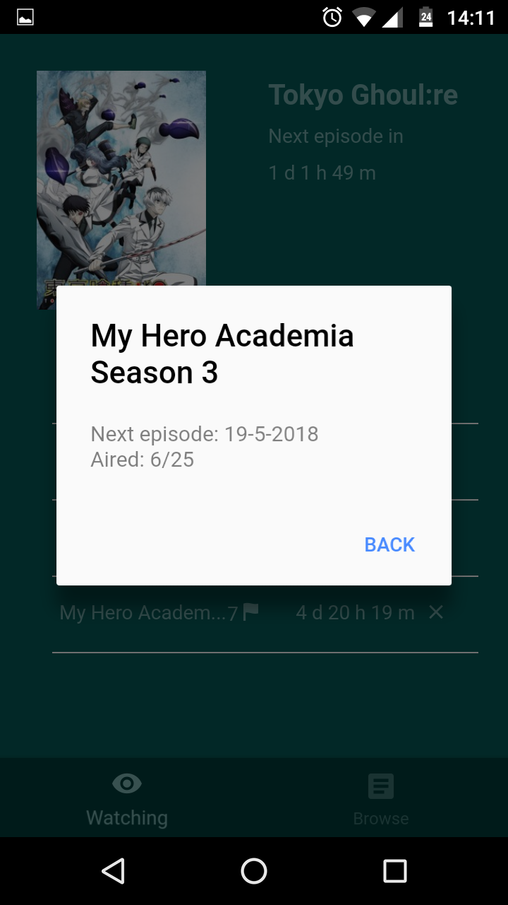|
|--|--|

The 'Browse' tab allows to browse through the currently airing animes, searching by typed phrase as well as access to various settings. 

|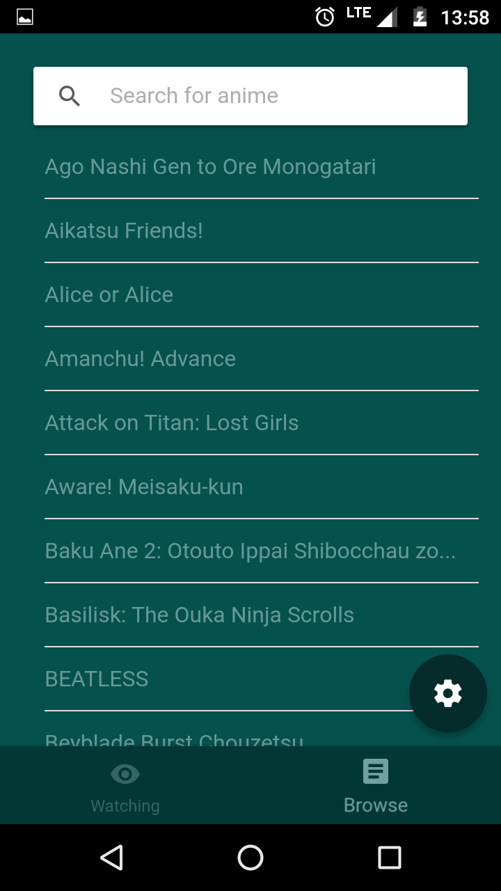|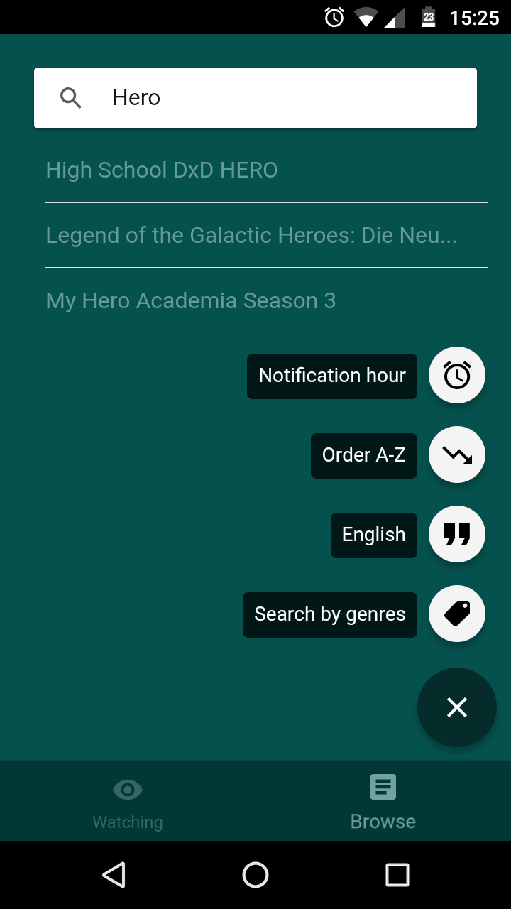|
|--|--|

The animes can be browsed by genres of choice as well.

|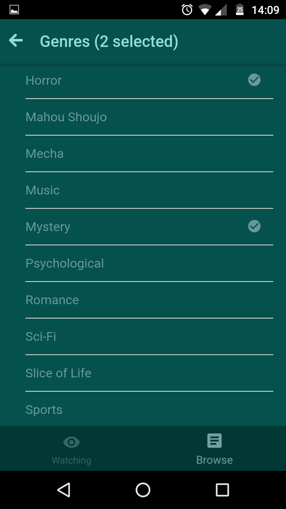|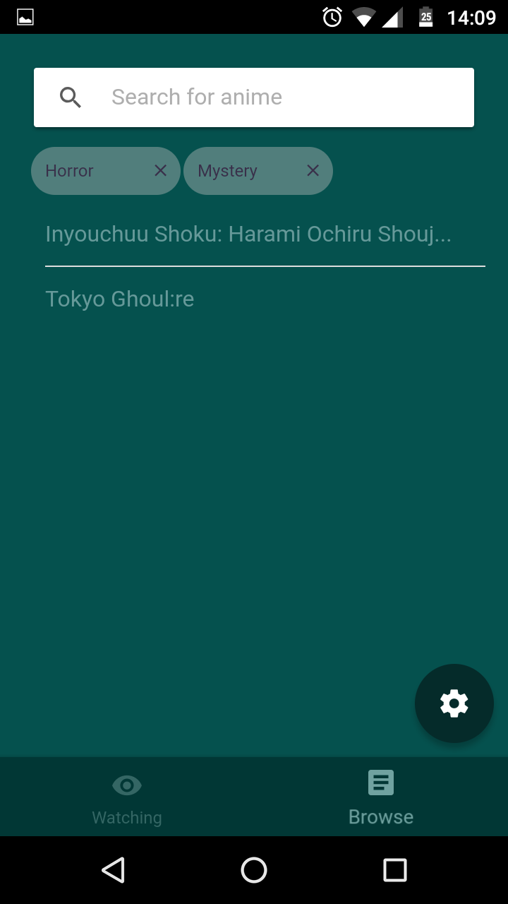|
|--|--|

Displayed titles can both in english or romanji as well as japanese.

|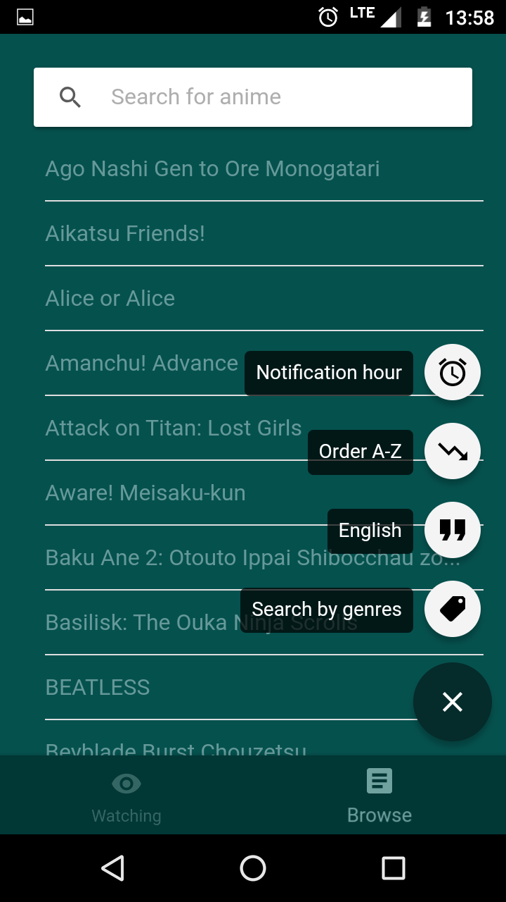|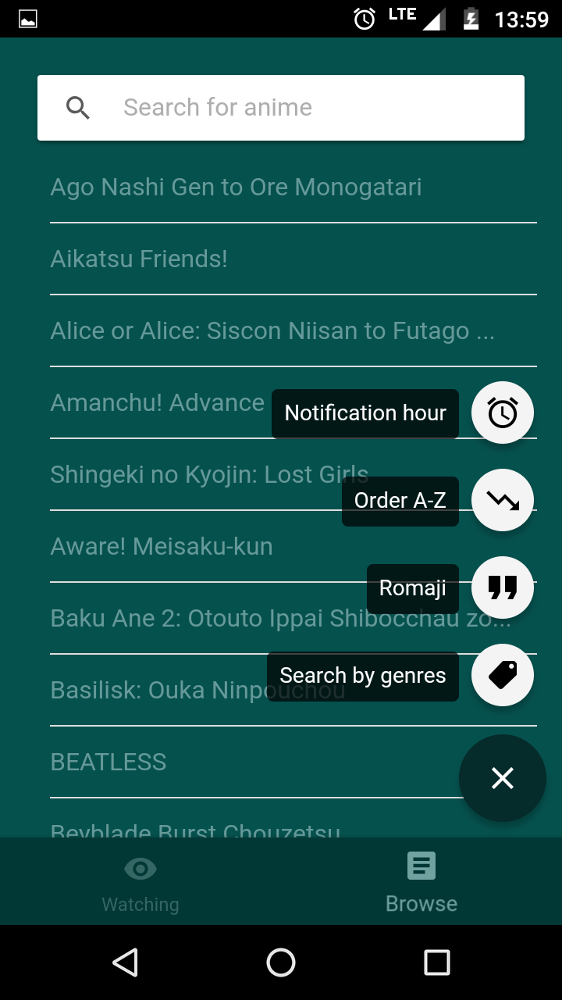|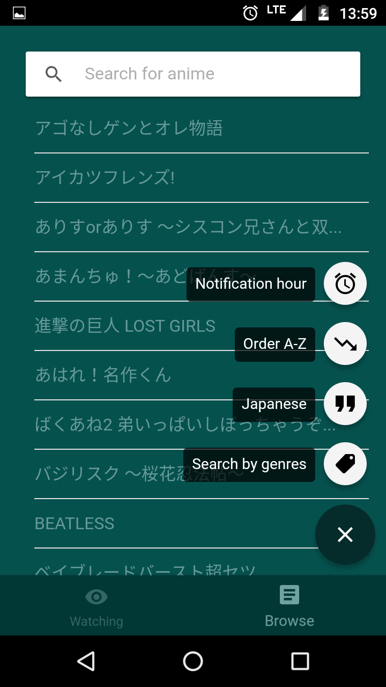|
|--|--|--|

After the title selection, more info is displayed afterwards, such as cover, full title, next episode airing date as well as the anime's description. In this place the new title can be added to the watching list.

|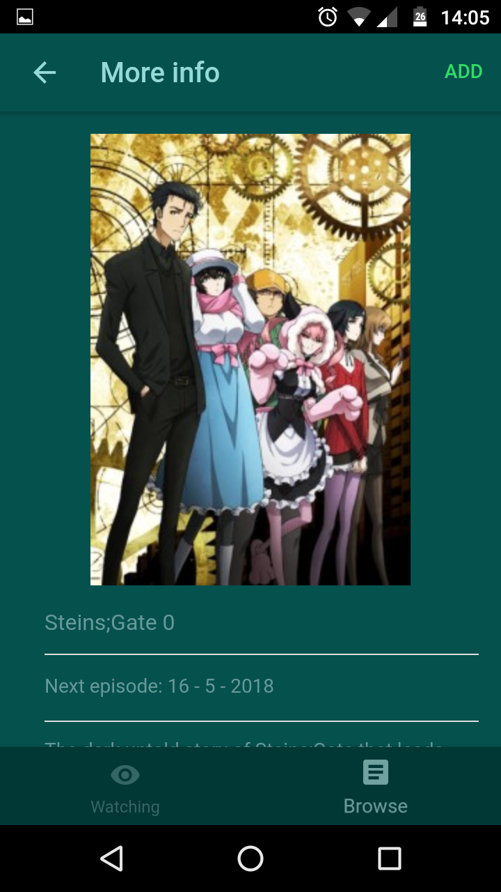|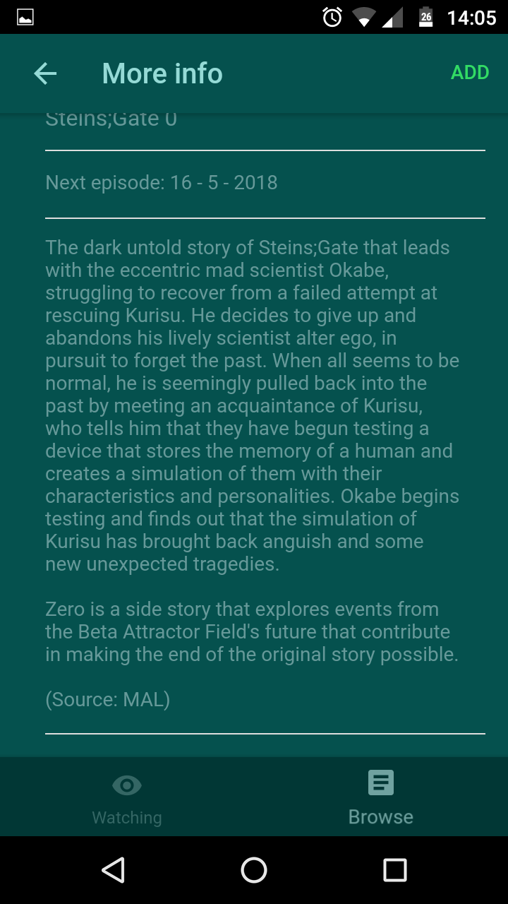|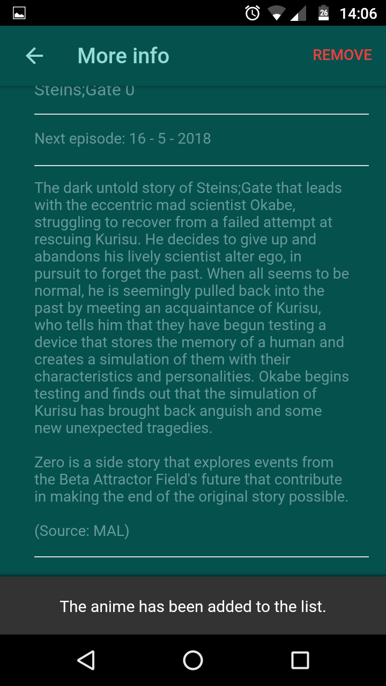|
|--|--|--|

The user can choose when he/she would like to receive the new notification (at the same time as the premiere or later on in the selected hour).

|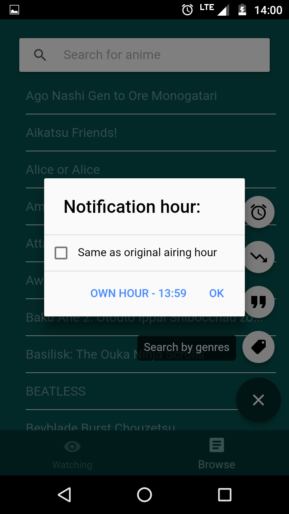|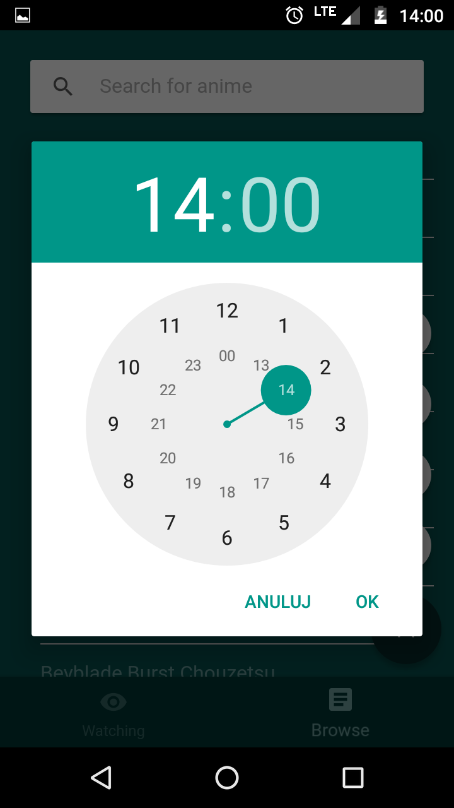|
|--|--|
